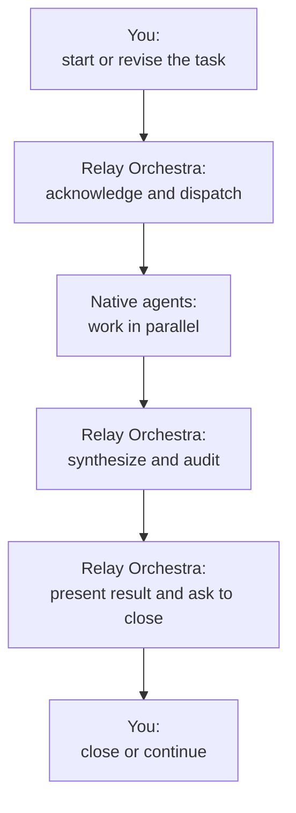

<h1 align="center">Relay Orchestra</h1>

<p align="center"><strong>Coordinate parallel agents across large, cross-cutting tasks while you keep steering.</strong></p>

<p align="center">
  <a href="https://www.skills.sh/sda-31/relay-orchestra/relay-orchestra"></a>
  <a href="https://agentskills.io/specification"></a>
  <a href="LICENSE"></a>
</p>

<p align="center">
  <a href="#quick-start">Install</a> ·
  <a href="#when-it-helps">When it helps</a> ·
  <a href="#how-a-live-session-works">Live sessions</a> ·
  <a href="#compatibility-and-limitations">Compatibility</a> ·
  <a href="#documentation">Documentation</a>
</p>

---

Relay Orchestra is an explicit multi-agent orchestration skill for large, cross-cutting work. It coordinates your client's built-in agents, assigns focused workstreams, and combines them into one verified result in either a one-shot request or a live multi-turn session.

Use it for market or competitor research, large codebase audits, module or multi-module implementation, migrations, and cross-cutting reviews. Clients without live parallel support fall back honestly to bounded waves, sequential work, or dispatch-ready briefs.

A live session stays active across related follow-ups, even after the objective appears complete. It enters shutdown only after a later direct answer to its current close question or an explicit stop command. An explicit one-shot invocation ends in the same response without a close question or cross-turn persistence.

## Quick Start

Relay Orchestra has no runtime dependencies. The skills CLI uses Node.js only during installation:

```sh
npx skills add SDA-31/relay-orchestra
```

The CLI detects supported agents and installs for the project in your current directory by default; add `-g` for a user-level installation.

[View it on skills.sh](https://www.skills.sh/sda-31/relay-orchestra/relay-orchestra), or see [Installation](INSTALL.md) for standalone scripts, pinned revisions, exact paths, and custom destinations. After an update, an active task may retain the skill instructions it already loaded. Start a new task or chat before relying on updated instructions. If cached content remains, use the client's documented refresh or restart procedure.

### Invoke It

These examples use Codex's `$relay-orchestra` syntax; in other clients, use their explicit skill picker or command with the wording after that prefix. A bare explicit invocation defaults to a live session:

```text
$relay-orchestra Start a live Relay Orchestra session. Run three read-only agents to review the
current changes, then verify and synthesize their findings while I keep steering.
```

For bounded work that must not persist:

```text
$relay-orchestra For this message only, run two reviewers and synthesize once.
```

If native agents are unavailable, a live session offers sequential fallback instead of applying it silently.

> [!WARNING]
> Delegated agents perform separate model work, whether concurrent or sequential, so tokens or credits can be consumed quickly. Start with the fewest agents that provide distinct value.

With cross-turn background support, a successful live-session start can return this short receipt while work continues:

```text
NOW: three reviewers active
QUEUED: verification and synthesis after their reports
AGENTS: 3 active / 0 queued / 3 requested
```

## When It Helps

Use Relay Orchestra when distinct parts of a large task need centralized coordination:

- **Market research:** split competitors, sources, regions, or hypotheses, then synthesize one result.
- **Large codebases:** divide exploration or audits by subsystem and specialist perspective.
- **Module development:** separate investigation, implementation, testing, and review across one or several modules.
- **Migrations and cross-cutting changes:** coordinate discovery, dependencies, staged execution, and final verification.

A single agent is usually a better fit for small, linear changes. Relay Orchestra adds value when work has distinct ownership areas and one coordinator must track dependencies, accept new instructions, and verify the combined result.

## What It Does

- **Keeps orchestration moving.** Relay distinguishes queued results from automatic wake and continues through dependent waves, integration, verification, and a completion candidate without requiring another user message.
- **Accepts changes mid-run.** Add, revise, reprioritize, hold, or cancel work while agents are active.
- **Uses native agents.** Relay Orchestra delegates through the host client instead of launching external agent CLIs.
- **Schedules to capacity.** Request any positive number of agents; Relay accounts for every slot and uses waves in live sessions when the client has fewer slots.
- **Coordinates and verifies.** It assigns ownership, tracks dependencies, audits the outcome, and asks before closing the session.

## How a Live Session Works



You remain the source of truth. New instructions take priority over planned follow-up work and incoming results. Apparent completion leaves the session active: Relay Orchestra presents what is complete and any residual risks, then asks whether it may close. A direct affirmative answer begins safe shutdown; new related work or doubt cancels the pending close and continues the same session.

<details>
<summary><strong>Realistic multi-turn example</strong></summary>

```text
You: Start a live Relay Orchestra session. Improve the recipe import flow.
Start two researchers, then have one implementer use their findings.

Relay Orchestra: Working without worktree isolation. Agents share the current
working tree, and file changes appear there immediately.
NOW: two researchers active
QUEUED: implementation after research synthesis
AGENTS: 2 active / 1 queued / 3 requested

You: Support CSV first. Hold spreadsheet import for a later release, and keep
the current researcher who already mapped the data model.

Relay Orchestra: ACCEPTED: CSV is authoritative; spreadsheet import held.
NOW: data-model researcher reused; format research redirected to CSV
QUEUED: implementation brief updated

You: Add an accessibility reviewer after implementation. Do not delay the CSV
work if there is no free agent slot.

Relay Orchestra: ACCEPTED: accessibility review added.
NOW: research continues
QUEUED: implementation, then accessibility review as capacity becomes available
AGENTS: 2 active / 2 queued / 4 requested

You: Drop the animated preview. Reuse the format researcher to draft concise
error messages instead.

Relay Orchestra: ACCEPTED: animation superseded; copy task sent to the
context-rich researcher. CSV scope and accessibility review remain unchanged.
```

</details>

## Safety and Working Trees

Relay Orchestra uses the shared working tree by default and says so when a run starts. Concurrent writers must own separate paths; overlapping edits should be narrowed, serialized, or isolated.

Worktrees are opt-in. Relay Orchestra does not create or use one without explicit approval, and a branch alone is not treated as isolation. It does not bypass host permissions, make overlapping edits safe, or claim that a worker stopped when that cannot be confirmed.

## Compatibility and Limitations

Relay Orchestra follows the [Agent Skills specification](https://agentskills.io/specification), but the standard does not define subagents or background work. Full live behavior depends on runtime capabilities.

| Capability | Behavior |
| --- | --- |
| Agent Skills | Required for normal discovery and invocation. |
| Native subagents | Enables parallel delegation; otherwise Relay Orchestra offers sequential work or dispatch-ready briefs. |
| Background work across turns | Enables a continuous live session; otherwise work runs in short, disclosed waves. |
| Result notifications | Delivery is checked separately from whether a notification starts a coordinator turn. |
| Automatic coordinator wake | Enables native yield and resumption; otherwise Relay uses native short bounded completion waits and processes newer input between intervals. |
| Lifecycle controls | Follow-up, interruption, and closure vary by client and version. |
| Concurrency | The host sets practical limits; Relay Orchestra schedules within them. |
| Worktrees | Never assumed and always require explicit approval. |

Without auto-wake, a live session automatically uses native completion waits or polling in short bounded intervals while active work remains and a specific completion or status condition can be observed. Between intervals Relay processes newer user input and delivered results, then advances dependent waves, integration, verification, and synthesis. It discloses once that the coordinator remains **In Progress** and a message may wait up to one poll interval. A result, orchestration completion, redirect, stop, one-off pause or yield request, or real blocker ends the current polling cycle. Relay never uses shell sleep, a single long blind block, blind busy-polling, or polling with no active work or next condition. One-shot work repeats short native completion polls in its originating turn, treats an interval timeout as a scheduling tick, and deactivates after settling every controllable worker before its final response. A request to pause or yield until the user returns is an ordinary one-off instruction, not a mode, option, scope, toggle, or persistent policy.

See the dated [platform capability notes](skills/relay-orchestra/references/platforms.md). Relay Orchestra is an explicitly scoped coordinator, not an always-on automation framework.

## Documentation

- [Installation, updates, paths, and security](INSTALL.md)
- [Live-session control](skills/relay-orchestra/references/live-session.md)
- [Coordination patterns](skills/relay-orchestra/references/patterns.md)
- [Prompt examples](examples/prompts.md)
- [Contributing](CONTRIBUTING.md)
