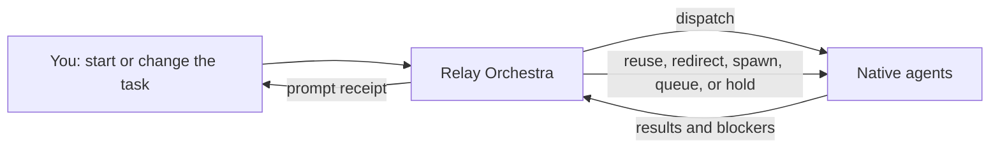

# Relay Orchestra

Coordinate several AI agents without giving up control of the conversation.

[](https://agentskills.io/specification)

[](LICENSE)

Relay Orchestra is an **explicit, multi-turn live coordinator**. You ask it to start for a particular task, it dispatches your client’s native agents, and it returns control promptly so you can keep giving instructions while work continues. It can reuse agents that already have useful context, redirect active work, spawn specialists, queue work behind dependencies or capacity, and hold ideas for later.

It stays active for the current task until the latest instructions are complete, you cancel it, or you ask it to stop. It does not silently apply itself to later tasks.

## Install

### macOS and Linux

Install to the open Agent Skills directory, `~/.agents/skills/relay-orchestra`:

```sh
curl -fsSL https://raw.githubusercontent.com/SDA-31/relay-orchestra/main/install.sh | bash
```

The installer downloads a temporary repository archive, validates its layout, installs the skill, and cleans up. It requires Python 3.7+ and prints the exact destination when it succeeds. Start a new task or chat afterward if your client caches its skill catalog.

Pass options after `bash -s --`:

```sh
curl -fsSL https://raw.githubusercontent.com/SDA-31/relay-orchestra/main/install.sh | bash -s -- --target codex
curl -fsSL https://raw.githubusercontent.com/SDA-31/relay-orchestra/main/install.sh | bash -s -- --project /path/to/project
```

Everything after `--` is forwarded unchanged. Use `--target all` only when you intentionally want separate copies for every supported client.

### Update

Repeat the same command and target options with `--force`:

```sh
curl -fsSL https://raw.githubusercontent.com/SDA-31/relay-orchestra/main/install.sh | bash -s -- --target codex --force
```

`--force` replaces the existing installation atomically. Without it, the installer refuses to overwrite anything.

### Inspect Before Running

The one-line command immediately executes code from the mutable `main` branch. Use it only if you trust this repository and GitHub's delivery path. To review the exact files first:

```sh
curl -fsSL https://raw.githubusercontent.com/SDA-31/relay-orchestra/main/install.sh -o relay-orchestra-install.sh
less relay-orchestra-install.sh
sh relay-orchestra-install.sh
```

The reviewed bootstrap still downloads the repository archive it installs. Clone the repository when you want to inspect both the entry point and payload. For a reproducible installation, replace `main` in the download URL with a verified full commit SHA and run the downloaded file with the matching ref:

```sh
curl -fsSL https://raw.githubusercontent.com/SDA-31/relay-orchestra/<full-commit-sha>/install.sh -o relay-orchestra-install.sh
less relay-orchestra-install.sh
RELAY_ORCHESTRA_REF=<full-commit-sha> sh relay-orchestra-install.sh
```

Downloading first also makes a failed `curl` visible before any script runs. A local clone remains the best option for development and for `--link`:

```sh
git clone https://github.com/SDA-31/relay-orchestra.git
cd relay-orchestra
./install.sh --link
```

### Windows PowerShell

```powershell
git clone --depth 1 https://github.com/SDA-31/relay-orchestra.git
Set-Location relay-orchestra
.\install.ps1
```

Pass options directly, for example `.\install.ps1 --target codex`. To update, run `git pull --ff-only`, then repeat the install command with `--force`. Without Git, use **Code → Download ZIP** on GitHub, extract it, and run `install.ps1` there.

### Which Install File?

| File | Use it when |
| --- | --- |
| `install.sh` | You are on macOS or Linux; it supports both the one-line remote install and a local checkout. |
| `install.ps1` | You are using Windows PowerShell. |
| `scripts/install.py` | Internal shared implementation. The two entry points call it automatically; users do not need to choose or invoke it. |

### Installation Targets

```sh
./install.sh                             # ~/.agents/skills
./install.sh --target codex              # $CODEX_HOME/skills or ~/.codex/skills
./install.sh --target claude             # ~/.claude/skills
./install.sh --target gemini             # ~/.gemini/skills
./install.sh --target cursor             # ~/.cursor/skills
./install.sh --target opencode           # ~/.config/opencode/skills
./install.sh --target copilot            # ~/.copilot/skills
./install.sh --project /path/to/project  # Project-local .agents/skills
```

### Agent-Assisted Installation

Direct installation above spends no model tokens. When an agent must perform it for you, give it this exact instruction:

```text
On macOS/Linux, run exactly:
curl -fsSL https://raw.githubusercontent.com/SDA-31/relay-orchestra/main/install.sh | bash
On Windows, clone https://github.com/SDA-31/relay-orchestra.git and run
.\install.ps1 from its root. Report the destination printed by the installer.
```

## What It Does

- **Keeps the conversation live.** After dispatching work, the coordinator gives you a short receipt instead of blocking until every agent finishes.
- **Accepts changes mid-run.** Add, revise, reprioritize, or cancel work while agents are active.
- **Routes changes deliberately.** Relay Orchestra can continue, update, interrupt, reuse, spawn, queue, hold, or supersede work based on what changed.
- **Uses native agents.** It delegates through the host client rather than launching external agent command-line tools.
- **Has no skill-level agent cap.** Ask for one agent or fifteen. If the client has less capacity, Relay Orchestra schedules waves and reports what is active, queued, completed, failed, or not started.
- **Coordinates ownership.** Read-only reviews, separate implementation areas, dependency waves, and research handoffs are assigned explicitly.
- **Verifies before finishing.** Worker reports are checked against the actual result before the session is finalized.

## How a Live Session Works



You remain the source of truth. New instructions take priority over planned follow-up work and incoming agent results.

## A Realistic Multi-Turn Example

```text
You: Use Relay Orchestra for this request only. Improve the recipe import flow.
Start two researchers, then have one implementer use their findings.

Relay Orchestra: Working without worktree isolation. Agents share the current
working tree, and file changes appear there immediately.
NOW: two researchers active
QUEUED: implementation after research synthesis
AGENTS: 2 active / 1 queued / 3 requested

You: Support CSV first. Hold spreadsheet import for a later release, and keep
the current researcher who already mapped the data model.

Relay Orchestra: ACCEPTED R2: CSV is authoritative; spreadsheet import held.
NOW: data-model researcher reused; format research redirected to CSV
QUEUED: implementation brief updated

You: Add an accessibility reviewer after implementation. Do not delay the CSV
work if there is no free agent slot.

Relay Orchestra: ACCEPTED R3: accessibility review added.
NOW: research continues
QUEUED: implementation, then accessibility review as capacity becomes available
AGENTS: 2 active / 2 queued / 4 requested

You: Drop the animated preview. Reuse the format researcher to draft concise
error messages instead.

Relay Orchestra: ACCEPTED R4: animation superseded; copy task sent to the
context-rich researcher. CSV scope and accessibility review remain unchanged.
```

The coordinator can keep processing turns like these until the current requirement revision is implemented, reviewed, and accounted for.

## Shared Tree and Worktrees

Relay Orchestra uses the **shared working tree by default**. It says so at the start of a run, and changes made by writing agents appear in the current checkout immediately.

Concurrent shared-tree writers must own separate paths. When work overlaps, attribution is unclear, the tree is already changing, or independent builds are needed, Relay Orchestra recommends narrower ownership, serialized work, or isolated worktrees.

**Worktrees are opt-in.** Relay Orchestra does not create or use them without explicit approval, and a branch by itself is not treated as isolation.

## Compatibility and Limitations

Relay Orchestra follows the [Agent Skills specification](https://agentskills.io/specification). Its full live behavior depends on the client’s capabilities at runtime.

| Capability | What to expect |
| --- | --- |
| Agent Skills support | Required for normal skill discovery and invocation. |
| Native subagents | Required for parallel delegation. Without them, Relay Orchestra can offer sequential work or dispatch-ready briefs. |
| Background work across turns | Required for a genuinely live session. Without it, the coordinator uses short, bounded waves and explains the limitation. |
| Agent lifecycle controls | Follow-up, interruption, and close controls vary by client and version. Missing controls may require read-only or serialized work. |
| Concurrency | The host client may impose a capacity or total-agent limit. Relay Orchestra adds no fixed limit of its own. |
| Worktree support | Not part of the Agent Skills standard and never assumed. Shared-tree mode remains the default. |

Current platform notes cover Codex, Claude Code, Gemini CLI, Cursor, OpenCode, GitHub Copilot CLI, goose, and other Agent Skills clients. Because these products change, Relay Orchestra checks runtime capabilities instead of relying only on a static compatibility claim. See [platform capability notes](skills/relay-orchestra/references/platforms.md).

Relay Orchestra is a run-scoped coordinator, not an always-on automation framework. It does not make overlapping shared-tree edits safe, bypass client permissions, guarantee unlimited concurrency, or launch external agent CLIs on its own.

## FAQ

### Do I need to invoke Relay Orchestra in every message?

Usually no. Invoke it explicitly when starting a task. On clients that preserve skill state, the ledger, and agent handles, it remains active across related follow-ups. When a client cannot preserve that state, Relay Orchestra discloses the limitation and provides an explicit `$relay-orchestra resume <token>:` continuation or uses bounded waves. After finalization or a stop, a later task needs a new invocation.

### Can I change my mind after agents start?

Yes. That is the main reason to use it. Give the new instruction normally; the coordinator decides which work can continue, which agent has useful context, and what should be redirected, queued, held, or cancelled.

### How many agents can I request?

Any positive number. Relay Orchestra has no skill-level cap. The host client may have practical or fixed limits, in which case the coordinator uses capacity waves and keeps an exact count.

### Does every task benefit from many agents?

No. One focused agent can be appropriate. More agents help when work can be separated into distinct questions, review lenses, file ownership, or dependency stages.

### Will several agents edit the same files at once?

They should not in shared-tree mode. Concurrent writers receive disjoint ownership. Overlapping edits should be serialized or moved to explicitly approved isolated worktrees.

### Can I stop a session early?

Yes. Ask Relay Orchestra to stop, close active workers safely, and report partial results. It stops new waves, accounts for unfinished work, and warns if a writer cannot be confirmed as stopped.

### What happens if my client does not support subagents?

Relay Orchestra explains the limitation and offers sequential local execution or prepared briefs that can be dispatched elsewhere. It does not pretend parallel agents are running.

## Learn More

- [Live-session control](skills/relay-orchestra/references/live-session.md)
- [Coordination patterns](skills/relay-orchestra/references/patterns.md)
- [Prompt examples](examples/prompts.md)
- [Contributing](CONTRIBUTING.md)

## Advanced Installer Options

```sh
./install.sh --link                      # Development symlink
./install.sh --dry-run --json            # Inspect without writing
./install.sh --destination /custom/path  # Exact custom skill directory
./install.sh --home /custom/home         # Resolve user targets from another home
```

## Explicit Invocation

Use a plain-language request:

```text
Use the relay-orchestra skill for this request only. Run three read-only agents
to review the current changes, then verify and synthesize their findings.
```

In clients with a skill command, use that client’s explicit form. For example, in Codex:

```text
$relay-orchestra run fifteen focused reviewers; use capacity waves if needed
```

## Repository Layout

```text
.
├── install.sh / install.ps1  # Friendly installer entry points
├── skills/relay-orchestra/   # Installable skill
├── examples/prompts.md       # Invocation examples
├── evals/                    # Forward-test scenarios
├── scripts/                  # Installer and dependency-free validation
├── tests/                    # Installer tests
└── .github/workflows/        # CI validation
```

Validate the repository with:

```sh
python3 scripts/validate.py
```

## Related Work

The design draws from public work by [Dimillian](https://github.com/Dimillian/Skills), [addyosmani](https://github.com/addyosmani/agent-skills), [obra/superpowers](https://github.com/obra/superpowers), [ZypherHQ](https://github.com/ZypherHQ/agent-orchestration-skill), [am-will](https://github.com/am-will/codex-skills), and [howells/arc](https://github.com/howells/arc).

## License

[MIT](LICENSE)
