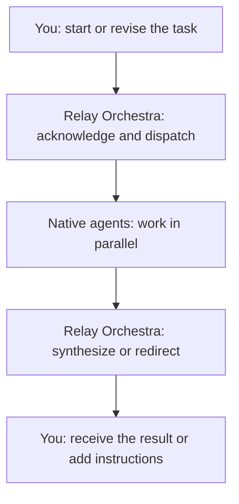

<h1 align="center">Relay Orchestra</h1>

<p align="center"><strong>Coordinate parallel agents across large, cross-cutting tasks while you keep steering.</strong></p>

<p align="center">
  <a href="https://www.skills.sh/sda-31/relay-orchestra/relay-orchestra"></a>
  <a href="https://agentskills.io/specification"></a>
  <a href="LICENSE"></a>
</p>

<p align="center">
  <a href="#quick-start">Install</a> ·
  <a href="#when-it-helps">When it helps</a> ·
  <a href="#how-a-live-session-works">Live sessions</a> ·
  <a href="#compatibility-and-limitations">Compatibility</a> ·
  <a href="#documentation">Documentation</a>
</p>

---

Relay Orchestra is a run-scoped multi-agent orchestration skill for large, cross-cutting work. It coordinates your client's built-in agents across a live multi-turn session, assigns focused workstreams, and combines them into one verified result while you keep steering.

Use it for market or competitor research, large codebase audits, module or multi-module implementation, migrations, and cross-cutting reviews. Clients without live parallel support fall back honestly to bounded waves, sequential work, or dispatch-ready briefs.

It stays active only for the current task and does not silently apply itself to later work.

## Quick Start

Relay Orchestra has no runtime dependencies. The skills CLI uses Node.js only during installation:

```sh
npx skills add SDA-31/relay-orchestra
```

The CLI detects supported agents and installs for the project in your current directory by default; add `-g` for a user-level installation.

[View it on skills.sh](https://www.skills.sh/sda-31/relay-orchestra/relay-orchestra), or see [Installation](INSTALL.md) for standalone scripts, pinned revisions, exact paths, and custom destinations. Start a new task or chat afterward if your client caches its skill catalog.

### Invoke It

Use your client's explicit skill picker or command when available (`$relay-orchestra` in Codex), or use this portable request:

```text
Use the Relay Orchestra skill for this request only. Run three read-only agents
to review the current changes, then verify and synthesize their findings.
```

> **Usage warning:** Every delegated agent run performs separate model work, whether concurrent or sequential, so token or credit use can rise quickly. Start with the fewest agents that provide distinct value, and check your client's usage or billing controls.

On clients with full live support, a successful start returns a short receipt while work continues; other clients disclose their bounded-wave fallback:

```text
NOW: three reviewers active
QUEUED: verification and synthesis after their reports
AGENTS: 3 active / 0 queued / 3 requested
```

## When It Helps

Use Relay Orchestra when distinct parts of a large task need centralized coordination:

- **Market research:** split competitors, sources, regions, or hypotheses, then synthesize one result.
- **Large codebases:** divide exploration or audits by subsystem and specialist perspective.
- **Module development:** separate investigation, implementation, testing, and review across one or several modules.
- **Migrations and cross-cutting changes:** coordinate discovery, dependencies, staged execution, and final verification.

A single agent is usually a better fit for small, linear changes. Relay Orchestra adds value when work has distinct ownership areas and one coordinator must track dependencies, accept new instructions, and verify the combined result.

## What It Does

- **Keeps the conversation live.** Dispatch returns promptly so you can keep steering.
- **Accepts changes mid-run.** Add, revise, reprioritize, hold, or cancel work while agents are active.
- **Uses native agents.** Relay Orchestra delegates through the host client instead of launching external agent CLIs.
- **Schedules to capacity.** Request any positive number of agents; the coordinator uses waves when the client has fewer slots.
- **Coordinates and verifies.** It assigns ownership, tracks dependencies, and checks worker reports before finalizing.

## How a Live Session Works



You remain the source of truth. New instructions take priority over planned follow-up work and incoming results.

<details>
<summary><strong>Realistic multi-turn example</strong></summary>

```text
You: Use Relay Orchestra for this request only. Improve the recipe import flow.
Start two researchers, then have one implementer use their findings.

Relay Orchestra: Working without worktree isolation. Agents share the current
working tree, and file changes appear there immediately.
NOW: two researchers active
QUEUED: implementation after research synthesis
AGENTS: 2 active / 1 queued / 3 requested

You: Support CSV first. Hold spreadsheet import for a later release, and keep
the current researcher who already mapped the data model.

Relay Orchestra: ACCEPTED: CSV is authoritative; spreadsheet import held.
NOW: data-model researcher reused; format research redirected to CSV
QUEUED: implementation brief updated

You: Add an accessibility reviewer after implementation. Do not delay the CSV
work if there is no free agent slot.

Relay Orchestra: ACCEPTED: accessibility review added.
NOW: research continues
QUEUED: implementation, then accessibility review as capacity becomes available
AGENTS: 2 active / 2 queued / 4 requested

You: Drop the animated preview. Reuse the format researcher to draft concise
error messages instead.

Relay Orchestra: ACCEPTED: animation superseded; copy task sent to the
context-rich researcher. CSV scope and accessibility review remain unchanged.
```

</details>

## Safety and Working Trees

Relay Orchestra uses the shared working tree by default and says so when a run starts. Concurrent writers must own separate paths; overlapping edits should be narrowed, serialized, or isolated.

Worktrees are opt-in. Relay Orchestra does not create or use one without explicit approval, and a branch alone is not treated as isolation. It does not bypass host permissions, make overlapping edits safe, or claim that a worker stopped when that cannot be confirmed.

## Compatibility and Limitations

Relay Orchestra follows the [Agent Skills specification](https://agentskills.io/specification), but the standard does not define subagents or background work. Full live behavior depends on runtime capabilities.

| Capability | Behavior |
| --- | --- |
| Agent Skills | Required for normal discovery and invocation. |
| Native subagents | Enables parallel delegation; otherwise Relay Orchestra offers sequential work or dispatch-ready briefs. |
| Background work across turns | Enables a continuous live session; otherwise work runs in short, disclosed waves. |
| Lifecycle controls | Follow-up, interruption, and closure vary by client and version. |
| Concurrency | The host sets practical limits; Relay Orchestra schedules within them. |
| Worktrees | Never assumed and always require explicit approval. |

See the dated [platform capability notes](skills/relay-orchestra/references/platforms.md). Relay Orchestra is a run-scoped coordinator, not an always-on automation framework.

## Documentation

- [Installation, updates, paths, and security](INSTALL.md)
- [Live-session control](skills/relay-orchestra/references/live-session.md)
- [Coordination patterns](skills/relay-orchestra/references/patterns.md)
- [Prompt examples](examples/prompts.md)
- [Contributing](CONTRIBUTING.md)

## License

[MIT](LICENSE)
