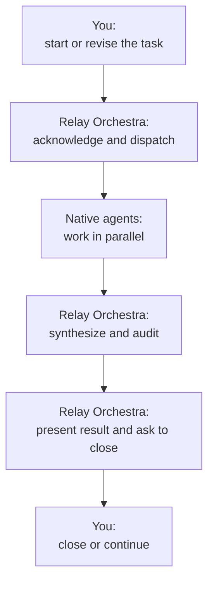

<h1 align="center">Relay Orchestra</h1>

<p align="center"><strong>Open-source Agent Skill for coordinating parallel AI agents across coding, research, audits, and migrations.</strong></p>

<p align="center">
  <a href="https://www.skills.sh/sda-31/relay-orchestra/relay-orchestra"></a>
  <a href="https://agentskills.io/specification"></a>
  <a href="LICENSE"></a>
</p>

<p align="center">
  <a href="#quick-start">Install</a> ·
  <a href="#when-it-helps">When it helps</a> ·
  <a href="#how-a-live-session-works">Live sessions</a> ·
  <a href="#compatibility-and-limitations">Compatibility</a> ·
  <a href="#documentation">Documentation</a> ·
  <a href="#feedback-and-support">Feedback</a>
</p>

---

Relay Orchestra is an explicit multi-agent orchestration skill designed for [Codex, Claude Code, Gemini CLI, and other Agent Skills clients](skills/relay-orchestra/references/platforms.md); available capabilities vary by client and version. It coordinates built-in subagents, gives each one a focused task, and combines their work into one checked result. Bounded tasks use a compact lite one-shot loop; work with multiple writers, worktrees, changing requirements, uncertain capabilities, or cross-turn continuity uses the full contract. An optional chat-scoped Auto preference can apply that router to later suitable tasks without keeping a session open.

Use it for market or competitor research, large codebase audits, module or multi-module implementation, migrations, and cross-cutting reviews. Clients without live parallel support fall back honestly to smaller batches, one-by-one work, or ready-to-send agent instructions.

A full live session stays active across related follow-ups, even after the objective appears complete. It enters shutdown only after a later direct answer to its current close question or an explicit stop command. Lite is always one-shot: it ends in the same response without a close question, ledger, or cross-turn persistence.

## Quick Start

Relay Orchestra has no runtime dependencies. The skills CLI uses Node.js only during installation:

```sh
npx skills add SDA-31/relay-orchestra
```

The CLI detects supported agents and installs for the project in your current directory by default; add `-g` for a user-level installation.

[View it on skills.sh](https://www.skills.sh/sda-31/relay-orchestra/relay-orchestra), or see [Installation](INSTALL.md) for standalone scripts, pinned revisions, exact paths, and custom destinations. After an update, an active task may retain the skill instructions it already loaded. Start a new task or chat before relying on updated instructions. If cached content remains, use the client's documented refresh or restart procedure.

### Invoke It

These examples use Codex's `$relay-orchestra` syntax; in other clients, use their explicit skill picker or command with the wording after that prefix. A bare invocation with no task enables Auto for this chat, explains the routing and usage implications, and asks what you want to do. It does not open a live session or launch agents:

```text
$relay-orchestra
```

A bare invocation with a concrete bounded task defaults to lite one-shot and does not silently enable Auto:

```text
$relay-orchestra Run three read-only agents to review the current changes, then verify and
synthesize their findings once.
```

Ask for full when work should persist or needs the heavier safety machinery:

```text
$relay-orchestra Start a full live session. Review the import flow while I keep steering.
```

Natural future-use wording also enables Auto. It may include a scope such as “reviews only, never implementation.” If the same message includes a current task, Relay runs that task normally and leaves Auto enabled afterward:

```text
$relay-orchestra Review the current diff once, and keep using Relay for suitable later tasks in this chat.
```

While Auto is idle, no agents, ledger, handles, polling, resume token, or close question exist. It delegates only when distinct workstreams, review lenses, or independent implementation and verification add material value; small linear tasks stay local. Say `auto off`—or ask naturally to stop using Relay for later tasks in this chat—to disable only the future preference. That does not stop an already active full live session unless you also ask to stop that session. Related requests always remain inside an active full live session instead of opening a competing Auto run. If native agents are unavailable, Relay offers sequential fallback instead of applying it silently.

`Full` describes the safety rules; `live` describes how long the session stays open. A bounded task can use full safety and still finish once, without a close question. If it must wait for your approval, a later requirement, or safe hand-back of an uncontrolled writer, it becomes full live and stays open until that lifecycle is settled.

Auto is local to the current chat. It does not transfer to a new chat, delegated child task, or unrelated session, grants no new permissions, and uses no resume token. Delegated agents perform separate model work and consume usage. In Codex, prompt-matched invocation must remain enabled so a later in-scope message can honor armed Auto or continue an active Full live run; the description still forbids activation without that surviving context. When a client preserves the chat preference and its scope across compaction or ordinary responses, Auto remains enabled; Relay does not claim persistence if the client discarded it. See [OpenAI's skill invocation policy](https://learn.chatgpt.com/docs/build-skills#optional-metadata).

> [!WARNING]
> Delegated agents perform separate model work, whether concurrent or sequential, so tokens or credits can be consumed quickly. Start with the fewest agents that provide distinct value.

When the host supports cross-turn background work and verified automatic wake, a successful live-session start can return this short receipt while work continues:

```text
NOW: three reviewers active
QUEUED: verification and synthesis after their reports
AGENTS: 3 active / 0 queued / 3 requested
```

## When It Helps

Use Relay Orchestra when distinct parts of a large task need centralized coordination:

- **Market research:** split competitors, sources, regions, or hypotheses, then synthesize one result.
- **Large codebases:** divide exploration or audits by subsystem and specialist perspective.
- **Module development:** separate investigation, implementation, testing, and review across one or several modules.
- **Migrations and cross-cutting changes:** coordinate discovery, dependencies, staged execution, and final verification.

A single agent is usually a better fit for small, linear changes. Relay Orchestra adds value when work has distinct ownership areas and one coordinator must track dependencies, accept new instructions, and verify the combined result.

## What It Does

- **Stays light on bounded work.** Lite avoids speculative capability probes, persistent ledgers, repeated status chatter, and close handshakes.
- **Keeps full orchestration moving.** Full distinguishes between a result being delivered and that result automatically waking the coordinator. It continues through dependent waves, integration, verification, and a proposed completed result without requiring another user message.
- **Accepts changes mid-run.** In a full live session, add, revise, reprioritize, hold, or cancel work while agents are active.
- **Uses native agents.** Relay Orchestra delegates through the host client instead of launching external agent CLIs.
- **Keeps coordination explicit.** Ordinary delegated agents stay leaf workers. If you explicitly ask to use Relay in separate delegated tasks or chats, those tasks may become child coordinators with their own bounded scope and local lifecycle; Relay never creates another coordination level silently.
- **Schedules to capacity.** Request any positive number of agents; Relay accounts for every slot and uses waves in live sessions when the client has fewer slots.
- **Coordinates and verifies.** It assigns ownership, tracks dependencies, audits the outcome, and asks before closing only when the selected full lifecycle requires it.

## How a Live Session Works


```mermaid
flowchart TD
    accTitle: Relay Orchestra live session
    accDescr: A user directs Relay Orchestra, which dispatches native agents, audits their work, and asks whether to close or continue.
    U["You:<br/>start or revise the task"]
    U --> C["Relay Orchestra:<br/>acknowledge and dispatch"]
    C --> A["Native agents:<br/>work in parallel"]
    A --> S["Relay Orchestra:<br/>synthesize and audit"]
    S --> Q["Relay Orchestra:<br/>present result and ask to close"]
    Q --> O["You:<br/>close or continue"]
```

You remain the source of truth. New instructions take priority over planned follow-up work and incoming results. Apparent completion leaves the session active: Relay Orchestra presents what is complete and any residual risks, then asks whether it may close. A direct affirmative answer begins safe shutdown; new related work or doubt cancels the pending close and continues the same session.

<details>
<summary><strong>Realistic multi-turn example</strong></summary>

```text
You: Start a live Relay Orchestra session. Improve the recipe import flow.
Start two read-only researchers, then have one implementer use their findings.

Relay Orchestra: Working without worktree isolation. Agents share the current
working tree, and file changes appear there immediately.
NOW: two researchers active
QUEUED: implementation after research synthesis
AGENTS: 2 active / 1 queued / 3 requested

You: Support CSV first. Hold spreadsheet import for a later release, and keep
the current researcher who already mapped the data model.

Relay Orchestra: ACCEPTED: CSV is authoritative; spreadsheet import held.
NOW: data-model researcher reused; format research redirected to CSV
QUEUED: implementation brief updated

You: Add an accessibility reviewer after implementation. Do not delay the CSV
work if there is no free agent slot.

Relay Orchestra: ACCEPTED: accessibility review added.
NOW: research continues
QUEUED: implementation, then accessibility review as capacity becomes available
AGENTS: 2 active / 2 queued / 4 requested

You: Drop the animated preview. Reuse the format researcher to draft concise
error messages instead.

Relay Orchestra: ACCEPTED: animation superseded; copy task sent to the
context-rich researcher. CSV scope and accessibility review remain unchanged.
```

</details>

## Safety and Working Trees

Relay can use the shared project checkout for read-only agents and when only one agent edits at a time, as long as existing and new changes can be tracked safely. If two or more agents may edit files at the same time, Relay plans a separate Git worktree (a separate project checkout) for each editor.

Relay never creates worktrees without asking. Before an editing agent starts, Relay lists the exact files it may change and the behavior that must stay compatible. It also explains disk, dependency, build-output, and cleanup costs. If worktrees are unavailable or declined, editing agents run one after another. The next agent starts only after the previous one finishes and Relay reviews its changes.

If Relay cannot tell who made an existing change, it treats the file as yours and does not edit it. You can allow Relay to edit a specific changed file; that permission covers only that file. A worktree keeps an agent's edits separate, but Relay still checks your changes before integration. If you edit a file while a shared-tree agent is editing it, Relay pauses overlapping work until both sets of changes are reviewed.

Worktrees separate checked-out files, so approved isolated agents may edit the same file at the same time. Relay records what each agent is trying to change, the shared starting revision, the combined expected behavior, and who will resolve conflicts. Agents may even touch the same lines when the parallel speedup is worth the merge cost. Without worktree isolation, same-file writers still run one after another.

Relay settles one finished and reviewed writer at a time by integrating its patch—including any reconciliation into the shared base—or explicitly abandoning it. It applies later same-file patches against the already updated code instead of replacing the whole file. A clean Git merge is not enough: Relay reviews and tests the combined behavior of every patch it integrates and reports any patch it abandons.

Explicit nested coordination is supported. A parent Relay session can delegate a separate task that also uses Relay when you ask for that structure. The child keeps its own ledger and agent budget, emits a resume token only when fallback continuity needs one, and asks a close question only in a live task that you can answer directly. Invisible or background child tasks use one-shot scope. The parent reports aggregate child activity, applies each requested agent limit to its stated scope, integrates the child result, and returns one clean synthesis instead of copying child handoffs or lifecycle artifacts.

Relay follows the authority already established by your request, repository instructions, and the host. Relay itself does not invent another confirmation for ordinary in-scope local work or repeat the same grant. The host or repository may still require a fresh approval for a later action or from an individual child task. Relay never bypasses those controls.

## Compatibility and Limitations

Relay Orchestra follows the [Agent Skills specification](https://agentskills.io/specification), but the standard does not define subagents or background work. Full live behavior depends on runtime capabilities.

| Capability | Behavior |
| --- | --- |
| Agent Skills | Required for normal discovery and invocation. |
| Native subagents | Enables parallel delegation; otherwise Relay Orchestra offers sequential work or dispatch-ready briefs. |
| Background work across turns | Enables a continuous live session; otherwise work runs in short, disclosed waves. |
| Result notifications | Delivery is checked separately from whether a notification starts a coordinator turn. |
| Automatic coordinator wake | Enables native yield and resumption; otherwise Relay uses native short bounded completion waits and processes newer input between intervals. |
| Lifecycle controls | Follow-up, interruption, and closure vary by client and version. |
| Context compaction | Compacting the chat does not close Relay. If the client preserves session state, Relay continues normally. Otherwise, Relay can continue only from a valid resume handle that it issued earlier for real unfinished work. Only the coordinator emits that opaque handle as one plain-text line—never Markdown code, raw ledger fields, JSON, or a worker handoff. An empty session gets no handle. |
| Concurrency | The host sets practical limits; Relay Orchestra schedules within them. |
| Worktrees | Planned by default for two or more concurrent writers; creation requires explicit approval. Approved worktrees support controlled same-file overlap; otherwise writers are serialized. |

Without auto-wake, a live session automatically uses native completion waits or polling in short bounded intervals while active work remains and a specific completion or status condition can be observed. Between intervals Relay processes newer user input and delivered results, then advances dependent waves, integration, verification, and synthesis. It discloses once that the coordinator remains **In Progress** and a message may wait up to one poll interval.

A result, orchestration completion, redirect, stop, one-off pause or yield request, or real blocker ends the current polling cycle. Relay never uses shell sleep, a single long blind block, blind busy-polling, or polling with no active work or next condition.

Lite one-shot work uses bounded native waits only while a necessary dependency wave remains active, processes newer user input first, and deactivates after settling every controllable worker before its final response. A healthy timeout may produce one compact progress update and another bounded wait, but never a polling state machine or a wait without active work. If Auto is enabled, the preference remains available for the next suitable task even though the run ended. A request to pause or yield until the user returns is an ordinary one-off instruction, not a mode, option, scope, toggle, or persistent policy.

See the dated [platform capability notes](skills/relay-orchestra/references/platforms.md). Relay Orchestra is an explicitly scoped coordinator, not an always-on automation framework.

## Documentation

- [Installation, updates, paths, and security](INSTALL.md)
- [Live-session control](skills/relay-orchestra/references/live-session.md)
- [Lite/full routing and portable client notes](skills/relay-orchestra/references/platforms.md)
- [Coordination patterns](skills/relay-orchestra/references/patterns.md)
- [Dispatch and handoff packets](skills/relay-orchestra/references/packets.md)
- [Prompt examples](examples/prompts.md)
- [Contributing](CONTRIBUTING.md)

## Feedback and Support

Found a bug, compatibility problem, or unclear instruction? [Open a GitHub issue](https://github.com/SDA-31/relay-orchestra/issues). Ideas and real-world test reports are welcome too.
